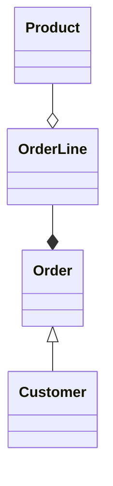

# consistency-bundary

[[eventstorming]]

在單體式架構系統中看起來似乎完全一致性，但為了達到一致性，有非常的邏輯依賴資料庫而被隱藏起來，難以窺見全貌與測試。
資料庫交易機制在一次執行中保障所有的狀態變化同時執行，但假如資料不一致時，就會產生失敗且需要額外的時間去調 查原因為何。
domain-driven-design避免複雜的實體關聯圖，取而代之的是開發人員必須找出最小邏輯且相互更新保持一致性的實體集合，
此集合被稱為`aggregate`

## domain model consistency

為複雜系統設計資料模型，許多表通過foreign key直接或間接的關聯，不斷的推動第三正規化避免重覆數據，導致需要用大量查詢檢索這些數據集。
假如先建立資料模型並以此開始編寫程式碼，會難以了解為何有強化制規則，那些欄位是必槙的，為何有與其他表格產生多對多的關聯。而這些關係難以測試，只能透過資料庫資料初始化產生來進行，而測試就會成為`database-oriented`

ddd提倡不同的設計方法，當domain model與持久化機制分離，主要為特定業務規則進行設計。處理domain model時，會在設計中追求不同目標。需要在類別封裝必要的訊息以確保任何狀態轉換都不會影響其一致性。此一致性並不是使用資料庫機制達成。以確保我們的物件不會違反業務定義的規則，並且這些規則需要在代碼中明確定義。

讓我們看看我們可以採用哪種原則，以及如何在以領域模型為中心的設計方法中定義不同類型的一致性邊界。 

## transaction boundaries

```csharp
[Route("/api/order/pay/credit/{orderId}")]
public async Task TakeOnCustomerCredit(int orderId)
{
    using(var context = new CommerceContext())
    using(context.Database.BeginTransactoin())
    {
        var order =await context.Orders.Where(x=>x.Id==orderId)..FirstAsync();
        var amount=order.UnpaidAmount;
        var customer=order.Customer;
        if(customer.Credit<amount)
        {
            throw new InvalidOperationException("Not enough credit");
        }
        customer.Credit-=amount;
        order.PaidAmount+=amount;
        order.UnPaidAmount-=amount;
        customer.TotalSpent+=amount;
        if(customer.TotalSpent>CommerceConstents.PreferredLimit)
        {
            customer.Preferred=true;
        } 
        order.IsPaid=order.UnpaidAmount==0;
        await context.SaveChangesAsync();  
    }
}
```
- er model

```mermaid
erDiagram
    Customer ||--|{ Order : placed
    Customer {
        pk name
        string Name
        string Address1
        string Address2
        string City
        string County
        decimal Credit
        bool Preferred
    }
    Order ||--o{ OrderLine : contains
    Order {
        pk Id
        Fk1 CustomerId
        decimal TotalAmount
        decimal PaidAmount
        decimal UnpaidAmount
        book IsPaid
        string DeliveryStatus
    }
    OrderLine o{--|| Product : link
    OrderLine {
        pk Id
        Fk1 OrderId
        Fk2 ProductId
        string ProductName
        decimal ProductPrice
        int Quantity
        int LineTotal
        bool IsShipped
    }
    Product{
    pk Id
    string Description
    decimal ListPrice
    }
```

1. a transaction is characterized by four principles 
    - Atomicity : 在一個transaction中的作業必須全部完成或是沒有發生任何事 (all or nothing)
    - Consistency
    - Isolation
    - Durability

在上一段程式碼可以看到使用信用卡付帳的整個作業被包含在交易機制，以下是在同一個model的另一個行為如下：
```csharp
public async Task ShipOrderLine(int orderLindId)
{
    using(var context=new CommerceContext())
    using(context.Database.BeginTransaction())
    {
        var orderLine=await context.OrderLines
                .Where(x=>x.Id==orderLineId)
                .FirstAsync();
        orderLine.IsShipped=true;
        orderLine.Order.DeliveryStatus=orderLine.Order.OrderLine.All(x=>xIsShipped)
                ? DeliveryStatus.Shipped:DeliveryStatus.PartiallyShipped;
        await context.SaveChangeAsync();
    }
}
```
2個方法單獨來看是沒有問題的，但處理`Transactional boundary`時，2個方法同時都會針對Order table操作，造成2個Transactional boundary相互重疊，意味者有可能在進行`TakeOnCustomerCredit`的同時，也可以進行`ShipOrderLine`方法，而將會造成 updates for different reasons cause unjustified conflicting transactions。

## Aggregate pattern



整體上構成一個邏輯上不可分割的結構，儘管此結構中可以找到單個元素，例如Order包含一個OrderLine，但也能多個OrderLine。此結構組成在DDD中稱為`Aggregates`。
當父物件被刪除時，其他子物件也必須一起被刪除，而父物件在aggregate稱之為`Aggregate root`。
tree就是一個單個根元素的複雜物件圖，所有分支都從根開始。aggregate不單只是類別的組合，aggregate boundaries等同transaction boundaries。 無論aggregate是否有使用持久化機制，aggregate都會改變整體的狀態，如果使用orm tool那aggregate含有多個 database tables，其所有相關的資料庫操作都必須包含在同一個交易機制。而在一致性方面, aggregate的狀態已在aggregate所有操作驗證過。同時，aggregate不保證aggregate外部的任何一致性約束。 對於資料庫模型來說，這代表著保持aggregate root的table與aggregate boundaries之外的任何內容之間具有完整性 。

將aggregate應用在上方的範例，可以發現`order`與`orderline`是一種組合關係，`orderline`在沒有`order`的情況下無法單獨存在
假如更改order中其中的一個orderline的狀態為`shipped`其order status也要同時改變，2者的作業必須一起執行，否則將會出現其中一個orderline已經是`shipped`的狀態，而order的狀態仍是`pending`，而我們希望order是`partially deliverd`，若狀態錯誤，則沒有達成一致性。當我們知道orderline是的個child object時，應該避免它的行為暴露，應該將它封裝在aggregate root內，只能透過aggregate root來進行操作。

- 針對order與orderline的資料表結構進行更動，order與customer 和orderline與product 之間關係取消了，但仍然保留其參考欄位`CustomerId`和`ProductId`，仍然需要知道客戶是否下訂單與銷售什麼產品。
- customer與product在系統中不需要object references in orm，，部份開發人員會認為這麼做會造成缺少完整性的負面影響，但事實上提供了很高的自由度(應該與CAP有關)。[CAP](https://zh.wikipedia.org/zh-tw/CAP%E5%AE%9A%E7%90%86)
- customer與product在order的context中應為value object，應由order context訂閱其所屬的context的事件而去達成最終一致性。

```mermaid
erDiagram
    Order ||--o{ OrderLine : contains
    Order {
        pk Id
        Fk1 CustomerId
        decimal TotalAmount
        decimal PaidAmount
        decimal UnpaidAmount
        book IsPaid
        string DeliveryStatus
    }
    OrderLine {
        pk Id
        Fk1 OrderId
        Fk2 ProductId
        string ProductName
        decimal ProductPrice
        int Quantity
        int LineTotal
        bool IsShipped
    }

    Product{
    pk Id
    string Description
    decimal ListPrice
    }

    Customer {
        pk name
        string Name
        string Address1
        string Address2
        string City
        string County
        decimal Credit
        bool Preferred
    }
```

- api controller
```csharp
public async Task ShipOrderLine(int orderId,int orderLineId)
{
    var order = await _orderRepository.Get(orderId);
    order.ShipOrderLine(orderLindId);
    await _orderRepository.Commit();
}
```
- order domain model
```csharp
public void ShipOrderLine(int orderLineId)
{
    var orderLine =OrderLine.First(x=>x.Id==orderLindId);
    orderLine.IsShipped=true;
    DeliveryStatus=OrderLine.Add(x=>x.IsShipped)?DeliveryStatus.Shipped:DeliveryStatus.PartiallyShipped;
}
```

orderline的雙向關係已被移除，由api的部份僅提供orderLindId，由order物件操作orderline。當order與customer之間沒有關係，應如何在同一個transaction完成2個不同物件的操作。這看起來是一件不可能的任務，而且常常會導致兩難的解決方法和捷徑，然後將aggregate視為一種阻礙，在一種或兩種特定情況下需要忽略的模式。 實際上，我們需要做相反的事情。 我們必須回到modeling space 查看有關的資訊, 處理流程如下
 
- checks whether the customer has enough credit to cover what remain unpaid in relation to an order
- decreases the customer's credit amount of the unpaid amount of the order
- increases the order's paid amount
- decreases the order's unpaid amount
- sets the order status to `paid` if the unpaid amount is zero
- increases the customer's total spent amount by the payment amount
- upgrades the customer to `preferred` status if the customer has spent over a certain threshold

1. 首先應檢查那些處理動作不屬於order processing或context，以下兩者應發生在付款完成之後，不僅限於信用卡，其他支付工具應該也適用
    - updating the total spent amount
    - upgrading the customer

2. 確認what we have to know 和一個order要做完什麼事才算完成
    - make sure that the remaining credit limit is higher or equal to the order unpaid amount

|customer profile|customer running credit|
|--|--|
|name,address,total credit limit| available credit limit|
|changes now and then|changes for each credit order|
|no rules for order processing| required for the consistency of order processing|

完整的customer並不適用以上的order processing的use cases。解決方案是只需移動確保order processing一致性的必要欄位即可，將customer分割為2個，各別對應自己的使用者案例，新增一個對應order processing的`CustomerCredit`entity

```mermaid
erDiagram
    Order ||--o{ OrderLine : contains
    Order o{--|| CustomerCredit: have
    Order {
        pk Id
        Fk1 CustomerId
        decimal TotalAmount
        decimal PaidAmount
        decimal UnpaidAmount
        book IsPaid
        string DeliveryStatus
    }
    OrderLine {
        pk Id
        Fk1 OrderId
        Fk2 ProductId
        string ProductName
        decimal ProductPrice
        int Quantity
        int LineTotal
        bool IsShipped
    }

    CustomerCredit{
        pk id
        decimal AvailableCredit
    }
```

現在aggregation已經移動到CustomerCredit且成為了aggregate root，以relational consistency的角度來看沒問題，但從order process來看，執行order processing的方法都要透過CustomerCredit，另一個負面影響是物件的所有權也出現變化，現在CustomerCredit負責所有事務，假設從系統中移除CustomerCredit的話，也必須移除掉有關order相關的物件。這不是我們希望發生的事，消費者是流動的，而我們希望追踨所有order，包含已完成的orderline，而不是移除它們。且重要的是我們需要足夠的信用額度才能支付訂單金額，即使額度不足，訂單本身仍然有效。

Order aggregate 規則

- the sun of `PaidAmount`  and `UnpaidAmount` should be equal to `TotalAmount`
- `DeliveryStatus` of an order can only be set to Delivered if,for all order lines of the `IsShipped` property,this is set to `true`
- the `TotalAmount` of an order must be equal to the sum of the `LineTotal` of all the order lines
- for each order line, `LineTotal` must equal the `ProductPrice` multiplied by `Quantity`
 
從以上的限制條件，可以發現並沒有要求有關available credit與product相關的訊息，確認order是否一致性，只需將必要訊息包含在order與order line同一個context即可，而且order不存在的話，orderline也沒有存在的意義，因此最後一步是取消customer與order之間的關係，但同樣保持與order、orderline之間的聚合。

```mermaid
erDiagram
    Order ||--o{ OrderLine : contains
    Order {
        pk Id
        Fk1 CustomerId
        decimal TotalAmount
        decimal PaidAmount
        decimal UnpaidAmount
        book IsPaid
        string DeliveryStatus
    }
    OrderLine {
        pk Id
        Fk1 OrderId
        Fk2 ProductId
        string ProductName
        decimal ProductPrice
        int Quantity
        int LineTotal
        bool IsShipped
    }

    CustomerCredit{
        pk id
        decimal AvailableCredit
    }
```

在context中有2個aggregate，這些aggregate必須在相同的context boundaries，但他們因為不同的transactional and consistency boundaries而分開，但在這個context中並沒有customer，無法得知客戶的available credit。
將檢查credit limit 邏輯移至domain service, ，利用EnsureEnoughCredit bool取代回傳available credit本身

```csharp
public interface ICustomerCreditService
{
    Task<bool> EnsureEnoughCredit(int customerId,decimal amount);
}
```

```csharp
public class OrderHandlingApplicationService
{
    private readonly IOrderRepository _orderRepository;
    private readonly ICustomerCreditService _customerCreditService;
    
    public OrderHandlingApplicationService(
    IOrderRepository orderRepository,
    ICustomerCreditService customerCreditService)
    {
        _orderRepository=orderRepository;
        _customerCreditService=customerCreditService;
    }

    public async Task Handle(TakeOnCustomerCredit command)
    {
        var order = await _orderRepository.Get(command.OrderId);
        var hasEnoughCredit=await _customerCreditService.EnsureEnoughCredit(command.OrderId,order.UnPaidAmount);
        if(!hasEnoughCredit)
            throw new DomainException($"Not enough credit for order {command.OrderId}");
        order.TaskOnCredit();
    }
}
```

將customer credit切割成單獨的實體可能會引發因為競爭情形而導致信用額度負數情況，在個別的交易下改變信用額度時，需要檢查是否發生負值的情況，並決定應如何處理。在某些情況下可能不會希望將domain logic移到application service，因此可以使用double dispatch pattern的方式，統一集中到order aggregate。

```csharp
public class Order:Aggregate<OrderId>
{
    public async Task TaskOnCredit (ICustomerCreditService customerCreditService)
    {
        var hasEnoughCredit=await _customerCreditService.EnsureEnoughCredit(command.OrderId,order.UnPaidAmount);
        if(!hasEnoughCredit)
            throw new DomainException($"Not enough credit for order {command.OrderId}");
        //actual  domain logic here
    }
}
```

```csharp
public async Task Handle(TakeOnCustomerCredit command)
{
    var order = await _orderRepository.Get(command.OrderId);
    await order.TaskOnCredit(_customerCreditService);
}
```

## protecting invariants

在[[implementing-model]]中透過[[domain-primitive]]封裝entity中的參數，並且提供了自我驗證、型別安全，而建立new entity或執行業務時，需要做更多的檢驗，確保參數之間的組合，entity state不會在執行後變成無效、錯誤的狀態。

保護內部狀態不會因為狀態變化導致domain model不一致 是aggregate重要的特徵之一。觸發狀態改變的每個操作都必須滿足聚合不變量，所以在聚合上使用任何命令方法時，都需要確保aggregate的狀態。


[//begin]: # "Autogenerated link references for markdown compatibility"
[eventstorming]: eventstorming.md "eventstorming"
[implementing-model]: implementing-model.md "implementing-model"
[domain-primitive]: domain-primitive.md "domain-primitive"
[//end]: # "Autogenerated link references"